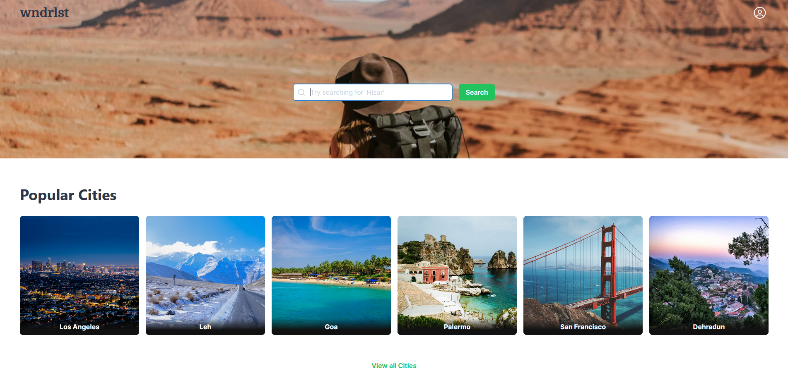
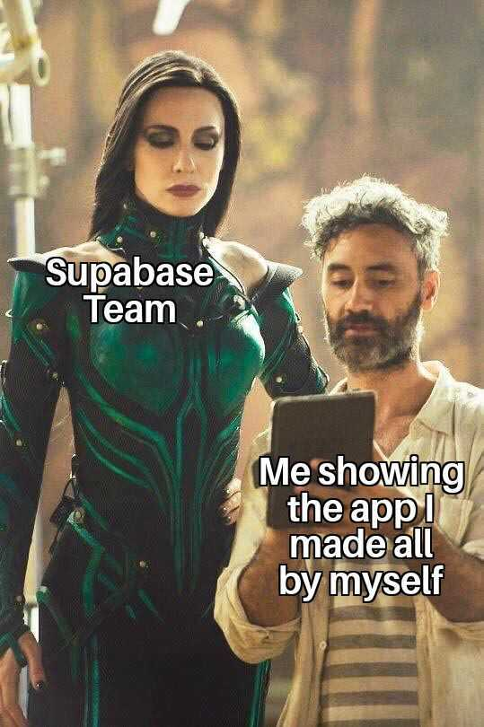

# wndrlst

Find Restaurants, Tourists spots, Shopping points, and much more in Cities you don't know much about.

#### 🌏 Online Demo

Hosted on Netlify: [https://wndrlst.netlify.app/](https://wndrlst.netlify.app/)
##### 💻 Running Locally

In the project directory, you can run:
1. `yarn`
2. `yarn start`

> Make sure you have env vars set up for Supabase

*If at any point app crashes and reloading doesn't help, clear the local storage. I am yet to handle the errors gracefully. 🙈*

---
#### ⚡ Supabase

Supabase used for:
1. Authentication - for email login
2. Database - for storing data related to cities, restaurants, likes, requests, etc.

#### 💪 Motivation

There's a cute little cafe in my city. I go there almost every weekend. The owners are very sweet and kind people. I really like the Tea they make. When I told my friends about that, they were completely unaware of it. I was actually surprised. There's this supa-nice cafe and that people don't know about. Tourists visit my city too, but when not even localites are familiar with it, how can they know? Wait! How many places like this I missed in the cities I've travelled to? It'd be nice if there was a free app that could list all the beautiful things about a city like Restaurants, Shopping points, Entertainment spots, etc.

This is how I got this idea. I've be procrastinating  this for a long time. But Supabase Hackathon was the perfect opportunity to get me going.

Though right now this app has limited features but I've planned to expand it more both horizontally and vertically. Some of the features to be added soon are:

- Reviews on Restaurants
- Listing request status for users
- Entertainment spots
- Reporting fake places
- ... so on

---

#### 👦 Team
Sanjeev Sharma - 
[thesnjvsharma](https://twitter.com/thesnjvsharma/)

